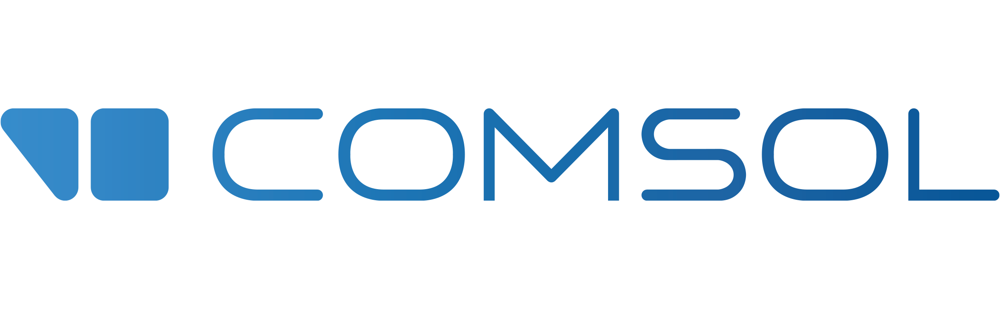
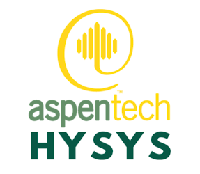

<h1 align="center">"Hello and Welcome to My Profile"</h1>
<h4 align="left">As a Scientific Software Engineer, I'm passionate about transforming complex models into high-performance, scalable code.</h4>

###

<h2 align="left">About Me</h2>

  ✨ <strong>Specialization:</strong> I specialize in developing high-performance software for scientific and engineering applications, focusing on computational modeling, numerical methods, and algorithm optimization. 
  
  🔧 <strong>Technical Expertise:</strong> My technical expertise includes C++, C#, Python, MATLAB, Java, and parallel computing, along with a strong background in scientific computing and simulation tools. 
  
  📚 <strong>Background:</strong> I hold a Ph.D. in Electrochemical Engineering and a M.Sc. in Petroleum & Chemical Engineering. With practical experience in both fields, I bring a solid scientific foundation to software development and computational modeling work.

  🎯 <strong>Goal:</strong> My goal is to build scalable, accurate, and reliable simulation tools that tackle real-world challenges in engineering and science. 
  
  💡 <strong>Passion:</strong> I am passionate about leveraging emerging technologies to improve computational performance, scalability, and user experience in complex technical applications.

###

<h2 align="left">Technologies Stack:</h2>

<table align="left">
  <tr>
    <td><strong>Programming Languages:</strong></td>
    <td>
      
      
      
      
      
      
    </td>
  </tr>

  <tr>
    <td><strong>Scientific Libraries:</strong></td>
    <td>
      
      
      
      
    </td>
  </tr>

  <tr>
    <td><strong>Simulation Tools:</strong></td>
    <td>
      
      
      
      
    </td>
  </tr>

  <tr>
    <td><strong>Developer Tools & IDEs:</strong></td>
    <td>
      
      
      
      
    </td>
  </tr>
</table>

              

<h2 align="left"> My Stats :</h2>

  

###
 

<h2 align="left">Connect with Me</h2>

  
  &nbsp;&nbsp;&nbsp;
  

###

